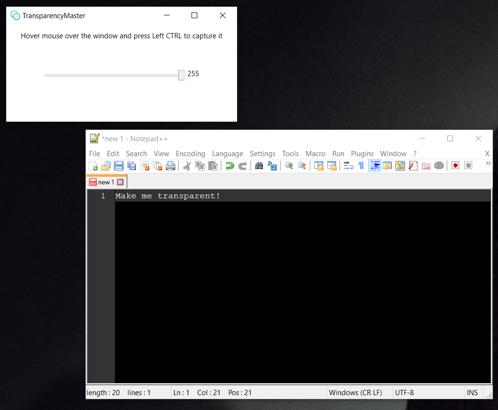
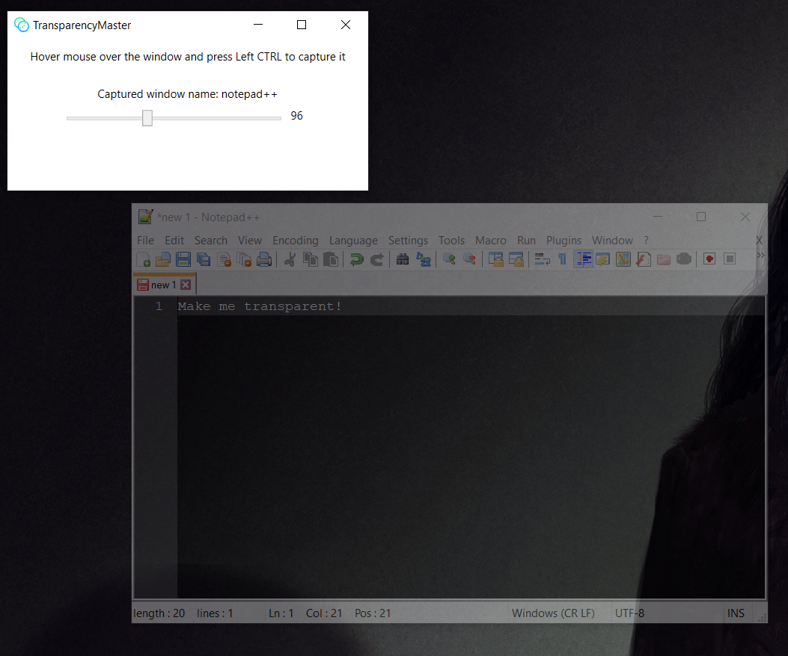

# Transparency Master

Simple WPF application that uses PInvoke calls to WinAPI in order to change captured window transparency.

## Usage
Entrypoint is the `TransparencyMaster.GUI` project.
- Build and run the project.
- With focused TransparencyMaster application window hover on the window for which you want to change opacity level.
- Press `left CTRL` to capture window handle.
- Move slider to change opacity level.




### Publishing as single file
The following command is an example of how to publish the application into single file with entire dotnet runtime in it:

```
dotnet publish -c Release -r win-x64 -p:PublishSingleFile=true --self-contained true
```

- Output file is will be in `TransparencyMaster.GUI\bin\Release\netcoreapp3.1\[win-runtime]\publish` folder
  - Where `win-runtime` is your selected windows runtime
- Windows runtime can be changed using `-r` switch

## Known issues
Some applications such as `Taskmgr` or `devenv` (Visual Studio) might not change their transparency level. If you know the reason or how to fix it, please let me know.